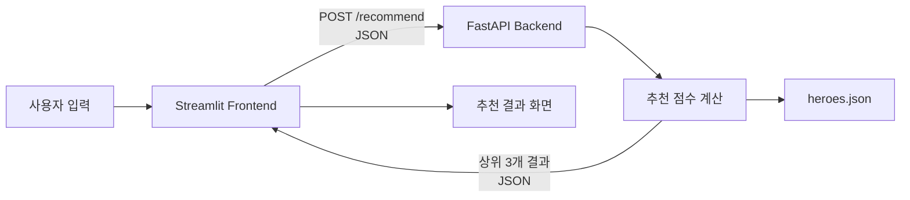

# Find Your Hero

> 사용자의 플레이 성향을 분석하여 가장 잘 맞는 **오버워치 영웅 3명**을 추천하는 웹 애플리케이션

- 과목: 오픈소스소프트웨어실습
- 학번 / 이름: **2023204017 최유진**
- GitHub: https://github.com/TAR0BUBBLE/2026_OSS_Final_Assignment

## 배포 주소

- Streamlit: http://32.196.247.53:8501
- FastAPI Swagger: http://32.196.247.53:8000/docs
- FastAPI Health Check: http://32.196.247.53:8000/health

> AWS Learner Lab의 EC2 인스턴스를 사용하므로 Lab 세션 종료 또는 퍼블릭 IP 변경 시 접속이 제한될 수 있습니다.

---

## 1. 프로젝트 소개

`Find Your Hero`는 사용자가 선호하는 역할, 교전 거리, 조준 자신감, 기동성, 공격 성향 등의 질문에 답하면 해당 성향과 가장 잘 맞는 오버워치 영웅을 추천해 주는 서비스입니다.

Streamlit으로 사용자 입력과 결과 화면을 구성하고, FastAPI가 입력값을 전달받아 규칙 기반 추천 점수를 계산합니다. 계산된 상위 3개의 추천 결과는 JSON으로 반환되며, Streamlit 화면에서 순위별 카드로 표시됩니다.

---

## 2. 전체 동작 흐름



1. 사용자가 Streamlit 화면에서 8개의 질문에 답합니다.
2. `결과보기` 버튼을 누르면 Custom Component 내부의 Fetch API가 FastAPI에 JSON 요청을 보냅니다.
3. FastAPI는 Pydantic 모델로 입력값을 검증합니다.
4. `recommender.py`가 사용자 응답과 영웅별 특성 점수를 비교합니다.
5. 점수가 높은 상위 3명의 영웅을 JSON으로 반환합니다.
6. Streamlit이 추천 순위, 일치율, 추천 이유와 영웅 이미지를 표시합니다.

---

## 3. 주요 기능

### Streamlit 프론트엔드

- 오버워치 테마의 사용자 인터페이스
- 총 8개의 플레이 성향 질문
- 카드 선택 및 슬라이더 입력
- 답변 진행도 표시와 이전 질문 이동
- 추천 요청 전 로딩 화면
- 상위 3개 추천 결과와 일치율 표시
- 각 영웅의 추천 이유 제공
- 결과 화면 내부 스크롤
- 처음부터 다시 시작
- 1920×1080 기준 비율 유지 및 화면 크기별 자동 축소
- FastAPI의 이미지 엔드포인트를 통한 브라우저 캐싱

### FastAPI 백엔드

- Pydantic 기반 입력값 검증
- 100점 만점의 규칙 기반 추천 알고리즘
- 추천 결과 상위 3개 반환
- 추천 이유 및 항목별 점수 생성
- UI 이미지 및 영웅 이미지 제공
- Swagger 자동 API 문서
- 서비스 상태 확인용 Health Check

### Docker / AWS

- Streamlit과 FastAPI를 서로 다른 컨테이너로 분리
- Docker Compose를 이용한 통합 실행
- 컨테이너 Health Check 적용
- AWS Learner Lab EC2에서 서비스 실행
- 컨테이너 재시작 정책 적용

---

## 4. 입력 문항

| 번호 | 입력 항목 | 입력 방식 |
|---|---|---|
| Q1 | 선호 역할 | 돌격 / 공격 / 지원 / 잘 모르겠음 |
| Q2 | 선호 교전 거리 | 단거리 / 중거리 / 장거리 |
| Q3 | 조준 자신감 | 1~5 단계 |
| Q4 | 기동성 선호도 | 1~5 단계 |
| Q5 | 공격적인 플레이 성향 | 1~5 단계 |
| Q6 | 선호 전투 위치 | 최전방 / 중간 전선 / 후방 / 측면·적 후방 / 유동적 |
| Q7 | 가장 중요한 능력 | 공격력 / 치유 / 생존력 / 전장 제어 / 아군 보호 / 쉬운 조작 |
| Q8 | 게임 경험 수준 | 입문자 / 중급자 / 숙련자 |

---

## 5. 추천 알고리즘

각 영웅은 역할, 교전 거리, 조준 난이도, 기동성, 공격성, 포지션 및 능력별 특성 점수를 가집니다. 사용자 응답과 영웅별 점수를 비교한 뒤 아래 가중치를 적용하여 최대 100점의 적합도를 계산합니다.

| 평가 항목 | 가중치 |
|---|---:|
| 역할 일치 | 25점 |
| 교전 거리 | 12점 |
| 조준 성향 | 12점 |
| 기동성 | 10점 |
| 공격성 | 10점 |
| 전투 위치 | 10점 |
| 중요 능력 | 16점 |
| 경험 수준 - 복잡도 | 3점 |
| 경험 수준 - 입문 친화도 | 2점 |
| **합계** | **100점** |

- 역할을 직접 선택한 경우 같은 역할의 영웅만 추천 후보가 됩니다.
- `잘 모르겠음`을 선택하면 모든 역할의 영웅을 비교합니다.
- 수치형 문항은 사용자 값과 영웅 특성값 사이의 거리가 가까울수록 높은 점수를 받습니다.
- 최종 점수가 높은 영웅 3명을 추천합니다.
- 동점일 경우 사용자가 중요하게 선택한 능력 점수 등을 추가 기준으로 사용합니다.

---

## 6. 기술 스택

| 구분 | 기술 |
|---|---|
| Frontend | Streamlit, HTML, CSS, JavaScript |
| HTTP Communication | Fetch API, JSON |
| Backend | FastAPI, Pydantic, Uvicorn |
| Recommendation | Python rule-based scoring |
| Container | Docker, Docker Compose |
| Deployment | AWS Learner Lab EC2 |
| Version Control | Git, GitHub |

---

## 7. 디렉터리 구조

```text
2026_OSS_Final_Assignment/
├── back/
│   ├── data/
│   │   └── heroes.json
│   ├── Dockerfile
│   ├── main.py
│   ├── recommender.py
│   ├── requirements.txt
│   └── schemas.py
├── front/
│   ├── assets/
│   │   ├── backgrounds/
│   │   ├── heroes/
│   │   ├── icons/
│   │   └── logos/
│   ├── data/
│   │   └── questions.json
│   ├── Dockerfile
│   ├── app.py
│   └── requirements.txt
├── .dockerignore
├── .env.example
├── .gitignore
├── docker-compose.yml
└── README.md
```

---

## 8. API 명세

| Method | Endpoint | 설명 |
|---|---|---|
| `GET` | `/` | API 기본 정보 |
| `GET` | `/health` | FastAPI 실행 상태 확인 |
| `GET` | `/docs` | Swagger API 문서 |
| `GET` | `/assets/{asset_path}` | 프론트엔드 UI 이미지 반환 |
| `GET` | `/hero-images/{hero_id}.png` | 결과 카드용 영웅 이미지 반환 |
| `POST` | `/recommend` | 사용자 응답을 기반으로 영웅 추천 |

### 추천 요청 예시

```json
{
  "role": "support",
  "range": 3,
  "aim": 3,
  "mobility": 2,
  "aggression": 2,
  "position": "backline",
  "priority": "healing",
  "experience": "beginner"
}
```

### 추천 응답 구조

```json
{
  "message": "플레이 성향 분석이 완료되었습니다.",
  "received_answers": {},
  "recommendations": [
    {
      "hero_id": "illari",
      "name_ko": "일리아리",
      "name_en": "Illari",
      "role": "support",
      "match_percentage": 92.0,
      "summary": "영웅 설명",
      "reasons": ["추천 이유"],
      "tags": [],
      "source_url": "공식 정보 URL",
      "score_breakdown": {},
      "hero_scores": {},
      "priority_metric": "healing"
    }
  ]
}
```

---

## 9. Docker 실행 방법

### 사전 조건

- Docker
- Docker Compose

### 실행

프로젝트 루트에서 다음 명령을 실행합니다.

```bash
docker compose up -d --build
```

컨테이너 상태를 확인합니다.

```bash
docker compose ps
```

정상적으로 실행되면 다음 주소로 접속할 수 있습니다.

- Streamlit: http://localhost:8501
- FastAPI: http://localhost:8000
- Swagger: http://localhost:8000/docs

### 로그 확인

```bash
docker compose logs --tail=50 front
docker compose logs --tail=50 back
```

### 종료

```bash
docker compose down
```

---

## 10. Python 로컬 실행 방법

### 백엔드

```bash
python3 -m venv .venv
source .venv/bin/activate

pip install -r back/requirements.txt
python -m uvicorn back.main:app --reload --host 0.0.0.0 --port 8000
```

### 프론트엔드

다른 터미널에서 실행합니다.

```bash
source .venv/bin/activate

pip install -r front/requirements.txt
python -m streamlit run front/app.py
```

접속 주소:

- Streamlit: http://localhost:8501
- FastAPI: http://localhost:8000

---

## 11. 환경변수

`FASTAPI_PUBLIC_URL`은 프론트엔드에서 호출할 FastAPI 공개 주소를 직접 지정해야 할 때 사용하는 선택 환경변수입니다.

현재 Docker 및 EC2 배포에서는 값을 별도로 지정하지 않습니다. 값이 없으면 브라우저가 현재 접속한 호스트의 `8000`번 포트를 자동으로 사용합니다.

```env
FASTAPI_PUBLIC_URL=
```

직접 Python으로 실행하면서 주소를 지정해야 할 경우에는 Streamlit 실행 전에 환경변수를 설정합니다.

```bash
export FASTAPI_PUBLIC_URL=http://localhost:8000
python -m streamlit run front/app.py
```

`.env.example`은 필요한 환경변수 형식을 안내하기 위한 예시 파일입니다. 실제 비밀값이나 개인 설정이 포함된 `.env` 파일은 Git에 커밋하지 않습니다.

---

## 12. EC2 배포 및 확인

EC2에서 저장소를 복제한 뒤 실행합니다.

```bash
git clone https://github.com/TAR0BUBBLE/2026_OSS_Final_Assignment.git
cd 2026_OSS_Final_Assignment

docker compose up -d --build
```

서비스 상태:

```bash
docker compose ps
```

FastAPI 확인:

```bash
curl http://localhost:8000/health
```

Streamlit 확인:

```bash
curl http://localhost:8501/_stcore/health
```

추천 요청 로그 확인:

```bash
docker compose logs --tail=50 back
```

정상 동작 시 `/recommend` 요청에 대해 `200 OK` 로그를 확인할 수 있습니다.

EC2 보안 그룹에는 다음 인바운드 포트가 필요합니다.

| 포트 | 용도 |
|---:|---|
| 22 | SSH |
| 8000 | FastAPI |
| 8501 | Streamlit |

---

## 13. 데모 영상

- YouTube 링크: 업로드 후 추가 예정

데모 영상에서는 다음 내용을 확인할 수 있도록 구성합니다.

- EC2 주소로 Streamlit 접속
- 사용자 입력
- 추천 요청
- 추천 결과 표시
- `docker ps` 실행 상태
- FastAPI의 `/recommend` 요청 로그

---

## 14. 저작권 안내

본 프로젝트는 대학 수업의 비상업적 교육 과제로 제작되었습니다.

Overwatch 및 관련 명칭, 로고, 캐릭터와 이미지에 대한 권리는 Blizzard Entertainment에 있습니다. 저장소에 포함된 관련 자료는 프로젝트 시연과 학습 목적으로만 사용합니다.
